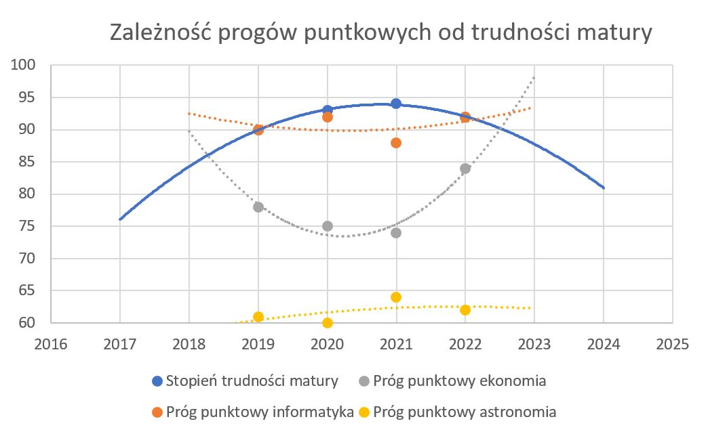

# Predykcja progów punktowych na Uniwersytet Warszawski
Prognozujemy progi punktowe w kolejnym roku w oparciu o:
- dane z CKE: https://cke.gov.pl/egzamin-maturalny/egzamin-maturalny-w-formule-2015/wyniki/
- statystyki rekrutacyjne z Uniwesytetu Warszawskiego:
https://rekrutacja.uw.edu.pl/statystyki-rekrutacyjne/
https://radon.nauka.gov.pl/dane/studia-prowadzone-na-okreslonym-kierunku

## Jak to działa ?
Skala centylowa służy do przedstawienia wyniku egzaminu, np. maturalnego. 
Wynik na skali centylowej to odsetek liczby maturzystów (zaokrąglony do liczby całkowitej), 
którzy uzyskali z danego przedmiotu na danym poziomie wynik taki sam lub niższy niż dany absolwent.

Uzyskując trend centylowy na danym kierunku studiów, po lipcowym udostępnieniu wyników matury przez CKE, jesteśmy w stanie wyliczyć czy progi punktowe w kolejnym roku powinny być wyższe czy niższe (w zależności od tego czy matura była trudniejsza czy prostsza).

